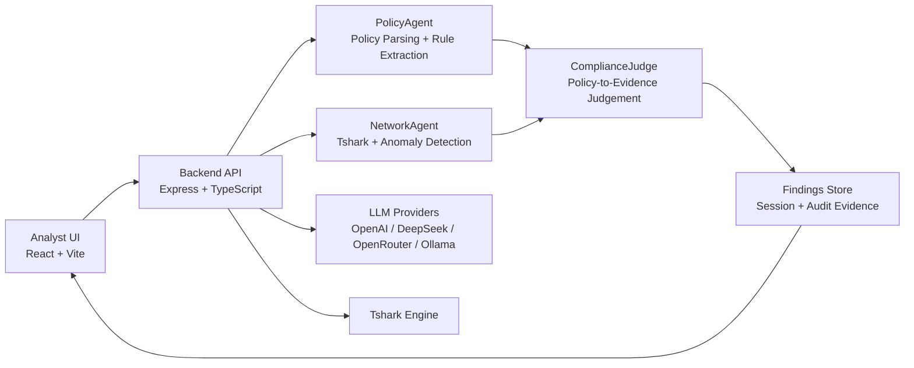

# SACA v13


[Demo Video](https://github.com/abyasham/security-audit-compliance-agent-v.13/releases/download/saca13/saca13.mp4)


SACA (Security Audit Compliance Agent) is a proposed next-generation solution for network security auditing.
It combines packet-level evidence, policy-aware reasoning, and multi-agent analysis to produce defensible compliance findings from pcap data.

## 30-Second Quick Start

```powershell
cd C:\saca\saca13
Copy-Item .env.example .env.docker
# Add at least one cloud key in .env.docker (OPENAI_API_KEY or DEEPSEEK_API_KEY or OPENROUTER_API_KEY)
docker compose --env-file .env.docker up --build
```

Open:

- Frontend: http://localhost:5173
- Backend health: http://localhost:3001/api/health

Why cloud keys: without them, only Ollama is marked configured.

## Executive Summary

Modern network teams still rely heavily on manual Wireshark triage, ad hoc scripts, and fragmented reporting.
SACA addresses this by providing a single workflow where analysts can:

- Upload a capture and policy document.
- Run an agentic analysis pipeline.
- Receive evidence-backed violated, compliant, and suspicious findings.
- Interactively investigate and validate findings through tool-assisted chat.

The design goal is practical audit acceleration, not black-box summarization.

## Positioning

SACA is inspired by strong agentic traffic-analysis patterns demonstrated in systems like NetTrace Agentix, while focusing on compliance judgment and policy-to-evidence mapping as first-class outcomes.

Where SACA is differentiated:

- Policy-agnostic compliance evaluation from uploaded policy text.
- Dedicated compliance judge stage after network analysis.
- Findings structure designed for audit defensibility and traceability.
- Built-in detection coverage for common enterprise and IoT attack patterns.

## Core Capabilities

- Multi-agent pipeline: PolicyAgent, NetworkAgent, ComplianceJudge.
- Evidence-driven chat tool loop with tshark-backed retrieval.
- Detection coverage includes:
  - DNS hijacking and spoofing.
  - DNS tunneling heuristics.
  - Session hijacking (token reuse across source IPs).
  - OS fingerprinting (SYN option signature diversity).
  - ARP spoofing, brute force, SYN scan, Mirai-like behavior.
- UI triage support with DNS-first findings sorting.
- Local-first deployment model for controlled security environments.

## Architecture Overview

1. Policy parsing and normalization.
2. Network traffic analysis and anomaly extraction.
3. Compliance judgment against policy clauses.
4. Findings persistence and analyst review.

High-level components:

- Backend: Express + TypeScript agent orchestration and APIs.
- Frontend: React + Vite analyst workspace.
- Packet engine: tshark/Wireshark CLI integration.
- Optional LLM providers: OpenAI, DeepSeek, OpenRouter, Ollama.



## Repository Layout

- `backend/` API, agents, and services.
- `frontend/` web application.
- `pcap/` dataset mapping and capture assets.
- `plans/` architecture and design notes.
- `policy/` sample policy artifacts.
- `scripts/` local start, stop, reset, and utility scripts.

## Prerequisites

- Node.js 20+
- npm 10+
- tshark (Wireshark CLI)

Windows default path:

- `C:\Program Files\Wireshark\tshark.exe`

If tshark is not on PATH, set `TSHARK_PATH` in local backend environment.

## Local Development (Windows)

Install dependencies:

```powershell
npm install
cd backend; npm install
cd ../frontend; npm install
cd ..
```

Run application:

```powershell
npm run start
```

Stop application:

```powershell
npm run stop
```

Endpoints:

- Frontend: http://localhost:5173
- Backend: http://localhost:3001
- Health: http://localhost:3001/api/health

## Docker Demo (Recommended for Sharing)

SACA can run without GPU by using cloud providers (OpenAI, DeepSeek, OpenRouter).

1. Create a local Docker env file from template:

```powershell
Copy-Item .env.example .env.docker
notepad .env.docker
```

2. Add only the provider keys you plan to use.

3. Start containers:

```powershell
docker compose --env-file .env.docker up --build
```

4. Stop containers:

```powershell
docker compose down
```

If cloud API keys are not supplied, only Ollama appears as configured.

## Security and Secret Management

SACA includes guardrails to reduce accidental secret commits:

- `.gitignore` blocks `.env`, `.env.local`, `.env.docker`, and common key/cert files.
- Pre-commit secret scanner blocks staged sensitive filenames and key-like token patterns.

Enable hooks after repository initialization:

```powershell
npm run security:install-hooks
```

Run manual staged scan:

```powershell
npm run security:scan-staged
```

Recommended local secret files:

- `backend/.env.local` for backend runtime keys.
- `.env.docker` for compose-based demos.

Tracked templates:

- `backend/.env.example`
- `.env.example`

## Validation and Faithfulness (GT-01..GT-13 + RAGAS)

SACA v13 uses GT-01 through GT-13 as a practical benchmark range to measure detection quality and explanation grounding.

Evaluation mechanism:

- Ground-truth anchor: known attack behavior from GT-01..GT-13 scenarios.
- SACA output under test: findings, evidence packet numbers, reasoning text, and policy linkage.
- RAGAS-style faithfulness focus: verify that model claims are supported by retrieved packet evidence and policy clauses, not hallucinated summaries.

Operational interpretation for this project:

- High faithfulness: finding reasoning is directly traceable to packet-level evidence and mapped policy text.
- Low faithfulness: reasoning includes unsupported claims, weak evidence linkage, or policy mismatch.

Current validation emphasis in this repository includes improvements proven on:

- GT-07 class behavior: DNS hijacking/spoofing detection quality.
- GT-10 class behavior: OS fingerprinting signal surfacing.
- GT-13 class behavior: session hijacking/token reuse visibility.

This GT + RAGAS-faithfulness workflow is used as a continuous mechanism to measure whether SACA remains evidence-grounded as capabilities evolve.

## Status

This project is an actively evolving proposal and implementation track for practical, explainable network security auditing.

